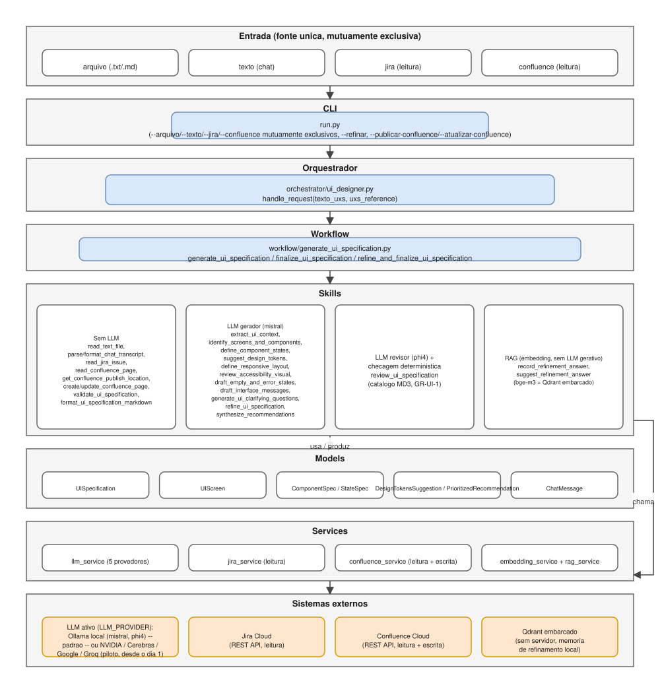
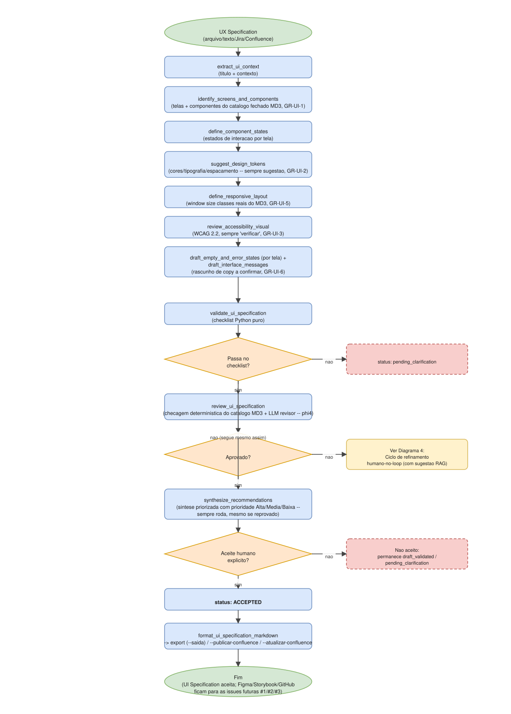
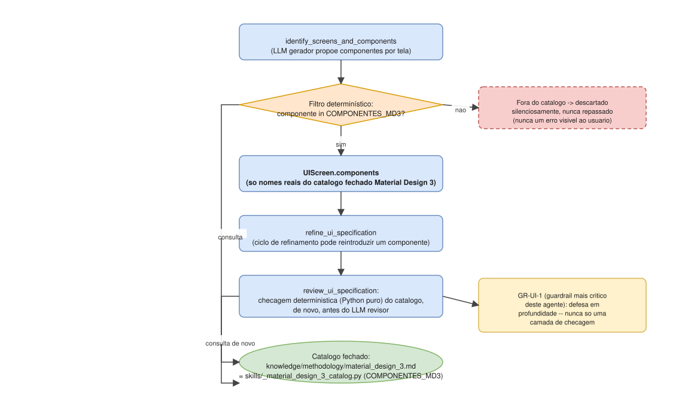
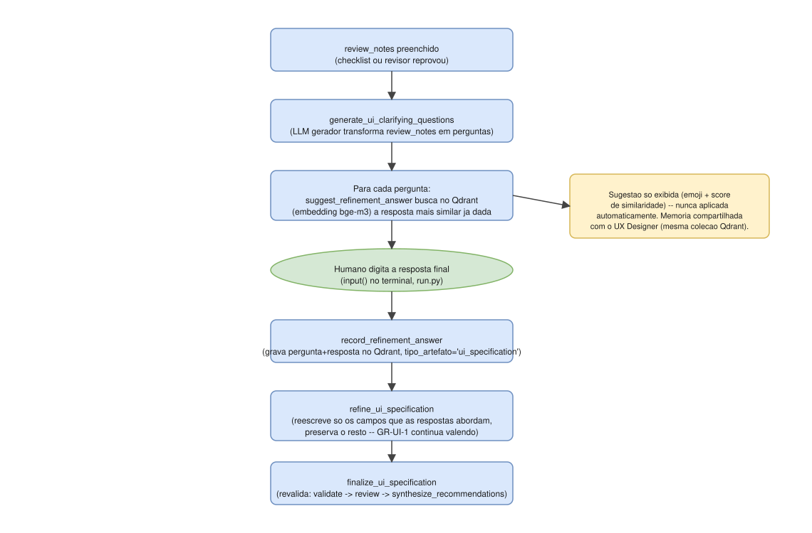
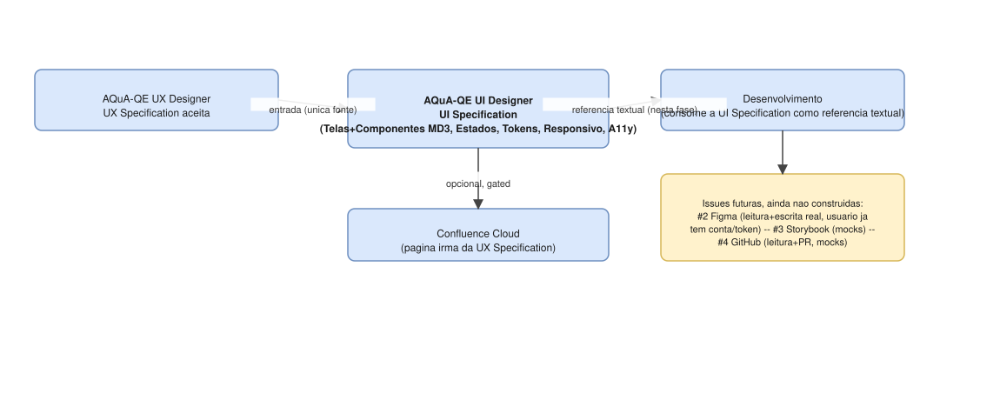

# Diagramas de arquitetura

Representação visual da arquitetura e dos fluxos do agente, complementando a documentação em prosa de `../agent/system_design.md`, `../agent/agent_design.md`, `../agent/skills.md` e `../../WHITEPAPER.md`.

- **Fonte editável**: [`architecture.drawio`](architecture.drawio) — arquivo único, 5 páginas, abra em [app.diagrams.net](https://app.diagrams.net) ou na extensão "Draw.io Integration" do VS Code.
- **Espelho estático**: `svg/*.svg` — mesmo conteúdo de cada página, visível diretamente aqui no GitHub/VS Code, sem precisar abrir o draw.io. Gerados por um conversor Python próprio (`.drawio` → SVG, interpretando containers/formas/arestas do mxGraph), não por exportação oficial do app draw.io — em caso de dúvida sobre fidelidade visual, o `.drawio` é a fonte de verdade; abra-o diretamente para conferir.

## 1 — Arquitetura em camadas

Da entrada — uma única fonte (arquivo/texto/Jira/Confluence, mutuamente exclusivas), sempre a UX Specification já pronta do agente irmão UX Designer — até o provedor de LLM ativo (Ollama local por padrão; piloto de NVIDIA/Cerebras/Google/Groq via `LLM_PROVIDER` **já desde a Fase 1**, diferente dos demais agentes que o adicionaram depois de necessidade real comprovada), Jira/Confluence Cloud e o Qdrant embarcado da memória de refinamento. As skills têm uma quarta banda além de "sem LLM"/"LLM gerador"/"LLM revisor": **RAG** (`record_refinement_answer`/`suggest_refinement_answer`), que usa embedding (`bge-m3`) mas nenhum LLM gerativo.

## 2 — Fluxo da UI Specification

`extract_ui_context` → `identify_screens_and_components` (catálogo fechado Material Design 3, GR-UI-1, com variante/tamanho/ícone/notas por componente — ícones sempre do catálogo fechado Material Symbols, GR-UI-7 — e a hierarquia visual da tela) → `define_component_states` (estados com contexto real, quando a fonte descreve um ponto assíncrono específico) → `suggest_design_tokens` (sempre sugestão, GR-UI-2) → `define_responsive_layout` (window size classes reais, GR-UI-5) → `review_accessibility_visual` (WCAG 2.2, sempre "verificar", GR-UI-3) → `draft_empty_and_error_states`/`draft_interface_messages` (rascunho de copy a confirmar, GR-UI-6) → `validate_ui_specification` → `review_ui_specification` (checagem determinística do catálogo **+** LLM revisor independente — phi4) → `[Refine]` → `synthesize_recommendations` (síntese priorizada Alta/Média/Baixa, roda sempre, mesmo se checklist/revisão reprovarem) → aceite humano → export/publicação. Mesmo esqueleto `Generate → Validate → Review → [Refine] → Approve` de PM/PO/SA/UX Designer. `navigation_sequence`/`icons`/`motion_notes` são construídos em Python puro no workflow, sem chamada nova ao LLM (GR-UI-8 para `navigation_sequence`, que nunca re-deriva lógica de fluxo — isso é responsabilidade exclusiva da UX Specification de origem).

## 3 — GR-UI-1 (catálogo fechado Material Design 3)

O guardrail mais crítico deste agente, com defesa em profundidade: `identify_screens_and_components` já descarta silenciosamente qualquer componente fora de `knowledge/methodology/material_design_3.md`/`skills/_material_design_3_catalog.py` (`COMPONENTES_MD3`) antes de retornar — mas como um ciclo de `--refinar` poderia reintroduzir um componente inválido, `review_ui_specification` roda a **mesma checagem determinística (Python puro)** de novo, antes mesmo de perguntar ao LLM revisor. Nunca uma única camada de checagem.

## 4 — Ciclo de refinamento humano-no-loop com memória RAG

Mesmo padrão de PM/PO/SA/UX Designer (perguntas objetivas via `generate_ui_clarifying_questions`, nunca autocorreção), com a mesma camada de memória institucional via RAG portada desde o dia 1: `suggest_refinement_answer` busca no Qdrant embarcado (embedding `bge-m3`, collection `refinement_answer_memory`) a resposta mais similar já dada — inclusive por outro agente/projeto, já que a collection é compartilhada — e a exibe como sugestão, **nunca aplicada automaticamente**. `refine_ui_specification` preserva o detalhe de qualquer campo que as respostas não abordem. Ver `../agent/memory.md`.

## 5 — Pipeline completo e handoff (UX Designer → UI Designer → Desenvolvimento)

Este agente consome a UX Specification aceita do AQuA-QE UX Designer (única fonte de entrada) e produz a UI Specification — nesta fase, uma referência textual para o Desenvolvimento, sem nenhuma integração real com Figma/Storybook/GitHub ainda (`figma_file_reference` existe no schema mas fica sempre vazio). Essas três integrações já viraram issues reais no repo: [#1](https://github.com/dufelizardo/AQuA-QE-UI-Designer/issues/1) Figma (leitura e escrita real, usuário já tem conta/token — spike de feasibility é o primeiro passo), [#2](https://github.com/dufelizardo/AQuA-QE-UI-Designer/issues/2) Storybook (só mocks nesta fase) e [#3](https://github.com/dufelizardo/AQuA-QE-UI-Designer/issues/3) GitHub (leitura e Pull Request, só mocks nesta fase). Ver `../../WHITEPAPER.md`, seção 11.
